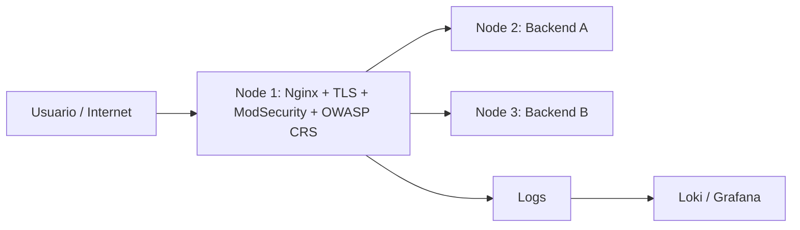
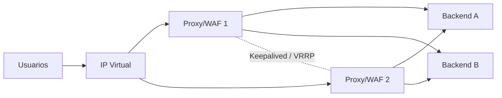

# Proxy Inverso Seguro con WAF y Alta Disponibilidad

## Descripción

Este proyecto propone el diseño e implementación de una arquitectura de seguridad para aplicaciones web basada en un **proxy inverso con Nginx**, un **Web Application Firewall (WAF) con ModSecurity v3 + OWASP Core Rule Set (CRS)** y **dos servidores backend** para distribuir las solicitudes y mantener la continuidad del servicio ante la caída de uno de ellos.

La solución busca combinar tres objetivos principales:

- **Seguridad:** inspeccionar y bloquear tráfico web malicioso antes de que llegue a la aplicación.
- **Disponibilidad:** mantener el servicio operativo si uno de los servidores backend falla.
- **Observabilidad:** centralizar registros y visualizar eventos de seguridad para facilitar el análisis.

---

## Problema

Cuando una aplicación web depende de un único servidor y está expuesta directamente a Internet, se presentan varios riesgos:

- Un fallo del servidor puede interrumpir completamente el servicio.
- La aplicación queda expuesta directamente a ataques en la capa web.
- La terminación TLS, el filtrado, los registros y la distribución de tráfico pueden quedar dispersos.
- Una configuración incorrecta del WAF puede producir falsos positivos o permitir ataques.

El proyecto plantea centralizar estas funciones en un nodo frontal y proteger dos servidores backend redundantes.

---

## Objetivo general

Diseñar e implementar, en un entorno controlado, un **proxy inverso seguro basado en Nginx y ModSecurity v3**, protegido con **OWASP CRS**, que permita distribuir tráfico entre dos servidores web y mantener el servicio disponible ante la caída de uno de los backend.

---

## Arquitectura propuesta

### Componentes principales

| Nodo | Rol | Tecnologías |
|---|---|---|
| Nodo 1 | Proxy inverso, WAF, TLS y balanceador | Nginx, ModSecurity v3, OWASP CRS |
| Nodo 2 | Servidor web Backend A | Nginx / Apache / aplicación web |
| Nodo 3 | Servidor web Backend B | Nginx / Apache / aplicación web |
| Observabilidad | Centralización y visualización de logs | Loki, Grafana, Alloy/Promtail |

---

## Flujo de funcionamiento

1. El cliente realiza una petición HTTPS.
2. Nginx recibe la solicitud en el nodo frontal.
3. ModSecurity analiza la petición usando las reglas de OWASP CRS.
4. Si la solicitud es maliciosa, el WAF la bloquea y registra el evento.
5. Si la solicitud es válida, Nginx la reenvía a uno de los servidores backend.
6. Si un backend no está disponible, las siguientes solicitudes se envían al servidor que permanece activo.
7. Los eventos de Nginx y ModSecurity pueden enviarse al sistema de logs para su análisis en Grafana.

---

## Tecnologías

- **Linux**
- **Nginx**
- **ModSecurity v3**
- **OWASP Core Rule Set**
- **SSL/TLS**
- **Loki**
- **Grafana**
- **Grafana Alloy o Promtail**
- **VirtualBox / VMware** para el laboratorio
- **Kali Linux** para pruebas controladas

---

## Metodología

El desarrollo utiliza el ciclo **PHVA (Planificar, Hacer, Verificar y Actuar)**.

### Planificar

- Definir la arquitectura de tres nodos.
- Establecer funciones de proxy, WAF, balanceo y backend.
- Definir reglas de red y puertos.
- Seleccionar Nginx, ModSecurity y OWASP CRS.
- Definir métricas de seguridad, rendimiento y disponibilidad.

### Hacer

- Implementar los dos servidores backend.
- Instalar y configurar Nginx.
- Integrar ModSecurity v3.
- Instalar OWASP CRS.
- Configurar certificados TLS.
- Configurar el balanceo.
- Centralizar los registros.

### Verificar

- Validar conectividad HTTPS.
- Comprobar la distribución de solicitudes.
- Simular la caída de cada backend.
- Ejecutar pruebas controladas de SQL Injection y XSS.
- Revisar falsos positivos.
- Medir tiempos de respuesta.
- Verificar el registro y visualización de eventos.

### Actuar

- Ajustar reglas del WAF.
- Reducir falsos positivos.
- Optimizar tiempos de respuesta.
- Mejorar políticas de logs.
- Documentar procedimientos.
- Preparar una segunda fase con alta disponibilidad integral.

---

## Pruebas principales

| Prueba | Resultado esperado |
|---|---|
| HTTPS | Acceso por el puerto 443 |
| Redirección HTTP → HTTPS | Las peticiones HTTP son redirigidas |
| Balanceo | Ambos backend reciben solicitudes |
| Caída Backend A | Backend B mantiene el servicio |
| Caída Backend B | Backend A mantiene el servicio |
| SQL Injection | ModSecurity genera evento y bloquea la solicitud |
| XSS | ModSecurity genera evento y bloquea la solicitud |
| Tráfico legítimo | No debe ser bloqueado innecesariamente |
| Logs | Los eventos pueden visualizarse y analizarse |
| Rendimiento | Se registra el tiempo de respuesta para comparar configuraciones |

---

## Métricas de evaluación

Las métricas principales consideradas son:

- Disponibilidad del servicio.
- Tiempo de respuesta.
- Distribución de solicitudes entre backend.
- Número de ataques bloqueados.
- Número de falsos positivos.
- Eventos generados por ModSecurity.
- Consumo de CPU y memoria.
- Latencia introducida por el WAF.
- Tiempo de recuperación ante la caída de un backend.

---

## Seguridad con ModSecurity y OWASP CRS

El WAF se implementa para detectar y bloquear solicitudes asociadas con vulnerabilidades comunes de aplicaciones web.

Entre las pruebas consideradas se encuentran:

- SQL Injection (SQLi)
- Cross-Site Scripting (XSS)
- Solicitudes anómalas
- Patrones maliciosos detectados por OWASP CRS

Un aspecto importante del proyecto es evaluar los **falsos positivos**, ya que una configuración demasiado restrictiva puede bloquear tráfico legítimo.

---

## Alta disponibilidad

La arquitectura base proporciona **redundancia en la capa backend**.

Si uno de los dos servidores de aplicación falla, Nginx puede continuar enviando las solicitudes al backend disponible.

> **Limitación actual:** el nodo frontal que contiene Nginx, TLS, ModSecurity y el balanceador sigue siendo un punto único de fallo.

### Mejora futura

Para obtener alta disponibilidad integral se propone una segunda fase:

Esta ampliación puede implementarse con:

- Segundo nodo Nginx + ModSecurity.
- **Keepalived / VRRP**.
- Dirección IP virtual.
- Sincronización de configuraciones.
- Pruebas de failover del nodo frontal.

---

## Beneficios

- Protección centralizada de aplicaciones web.
- Menor exposición directa de los servidores backend.
- Continuidad ante la caída de un backend.
- Uso de software de código abierto.
- Centralización de TLS y reglas de seguridad.
- Mayor visibilidad mediante logs y dashboards.
- Arquitectura escalable para agregar más backend.
- Posibilidad de evolucionar hacia alta disponibilidad integral.

---

## Costos

Los componentes principales utilizados son de código abierto:

- Nginx Open Source
- ModSecurity
- OWASP CRS
- Loki
- Grafana OSS
- Grafana Alloy / Promtail

Por ello, el costo de **licenciamiento del software principal es S/ 0**.

Los costos reales dependen de:

- VPS o servidores utilizados.
- CPU, RAM y almacenamiento.
- Retención de logs.
- Dominio.
- Certificados, si se utiliza una alternativa comercial.
- Horas de implementación y mantenimiento.

---

## Riesgos identificados

- Punto único de fallo en el proxy/WAF frontal.
- Reglas demasiado agresivas que generen falsos positivos.
- Reglas demasiado permisivas que reduzcan la protección.
- Degradación de rendimiento por inspección del tráfico.
- Crecimiento excesivo de logs.
- Certificados TLS vencidos.
- Incompatibilidades entre versiones.
- Dependencia de configuración manual.

### Estrategias de mitigación

- Agregar un segundo proxy/WAF.
- Utilizar Keepalived/VRRP.
- Mantener control de versiones de configuraciones.
- Probar cambios antes de producción.
- Ajustar progresivamente OWASP CRS.
- Automatizar renovación de certificados.
- Definir políticas de retención de logs.
- Realizar backups de configuraciones.

---

## Referencias académicas clave

- Arnaldy, D., & Hati, T. S. (2020). *Performance analysis of reverse proxy and web application firewall with Telegram bot as attack notification on web server*. 2020 3rd International Conference on Computer and Informatics Engineering (IC2IE), 455–459. https://doi.org/10.1109/IC2IE50715.2020.9274592

- Curipallo Martínez, M., Guevara-Vega, A., Reyes Narváez, A., Raura, G., & Barba Molina, H. (2025). *Web application protection optimization through Coraza WAF: Performance assessment against OWASP risks in reverse proxy configurations*. Engineering Proceedings, 115(1), 17. https://doi.org/10.3390/engproc2025115017

- Kumar, A., Somani, G., & Agarwal, M. (2024). *Comparing HAProxy scheduling algorithms during the DDoS attacks*. IEEE Networking Letters, 6(2), 139–142. https://doi.org/10.1109/LNET.2024.3383601

- Reyes Narváez, A., Curipallo Martínez, M., Reyes Narváez, E., Lara, F., Reyes Narváez, E. P., & Barba Molina, H. (2025). *Evaluation framework for false positives in open-source WAFs based on OWASP CRS paranoia levels: A systematic approach for comparative measurement*. Engineering Proceedings, 115(1), 1. https://doi.org/10.3390/engproc2025115001

- Zebari, R. R., Zeebaree, S. R. M., Sallow, A. B., Shukur, H. M., Ahmad, O. M., & Jacksi, K. (2020). *Distributed denial of service attack mitigation using high availability proxy and network load balancing*. 3rd International Conference on Advanced Science and Engineering (ICOASE), 174–179. https://doi.org/10.1109/ICOASE51841.2020.9436545

---

## Estado del proyecto

**En desarrollo / laboratorio académico.**

La primera etapa está orientada a validar:

- Seguridad del tráfico web.
- Funcionamiento del WAF.
- Balanceo entre servidores.
- Failover de los backend.
- Registro de eventos.
- Rendimiento de la arquitectura.

La siguiente etapa busca eliminar el punto único de fallo del nodo frontal e implementar alta disponibilidad integral.

---

## Autoría

Proyecto académico de **Seguridad Informática**  
Escuela Profesional de Ingeniería de Sistemas  
Universidad Privada de Tacna
